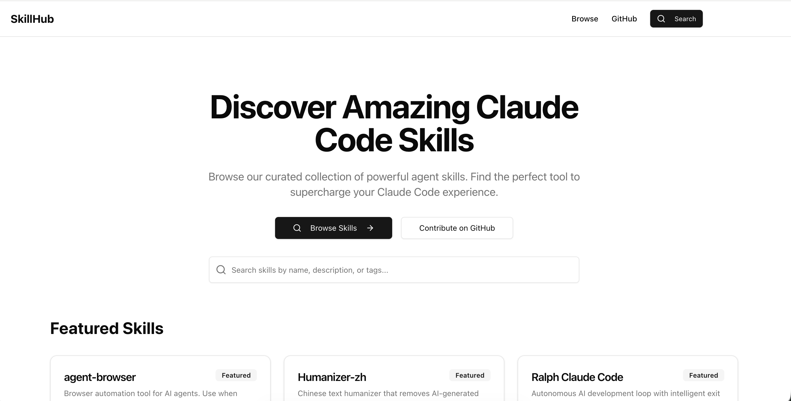
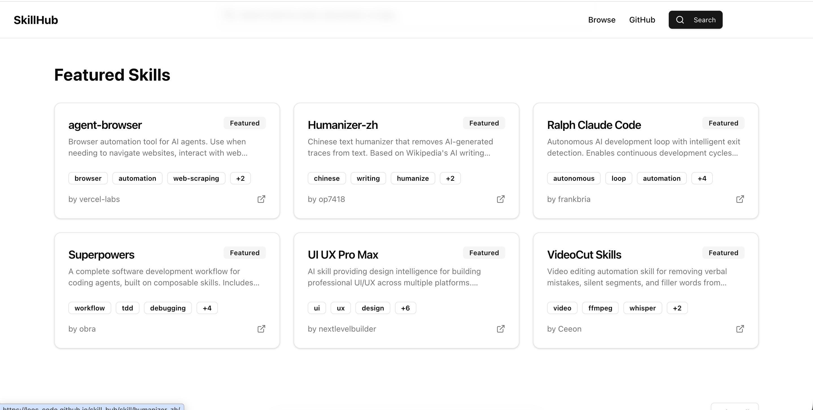
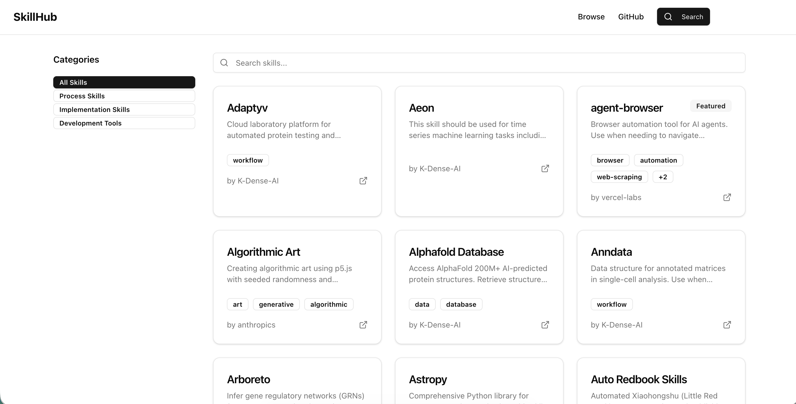

# SkillHub

A navigation site for discovering Claude Code agent skills.







## Development

```bash
npm install
npm run dev
```

## Build

```bash
npm run build
```

## Deploy

```bash
npm run deploy
```

## Adding Skills

1. Create a new JSON file in `skills/skills/`
2. Follow the schema in `lib/schemas.ts`
3. The site will automatically include your skill

## License

MIT
